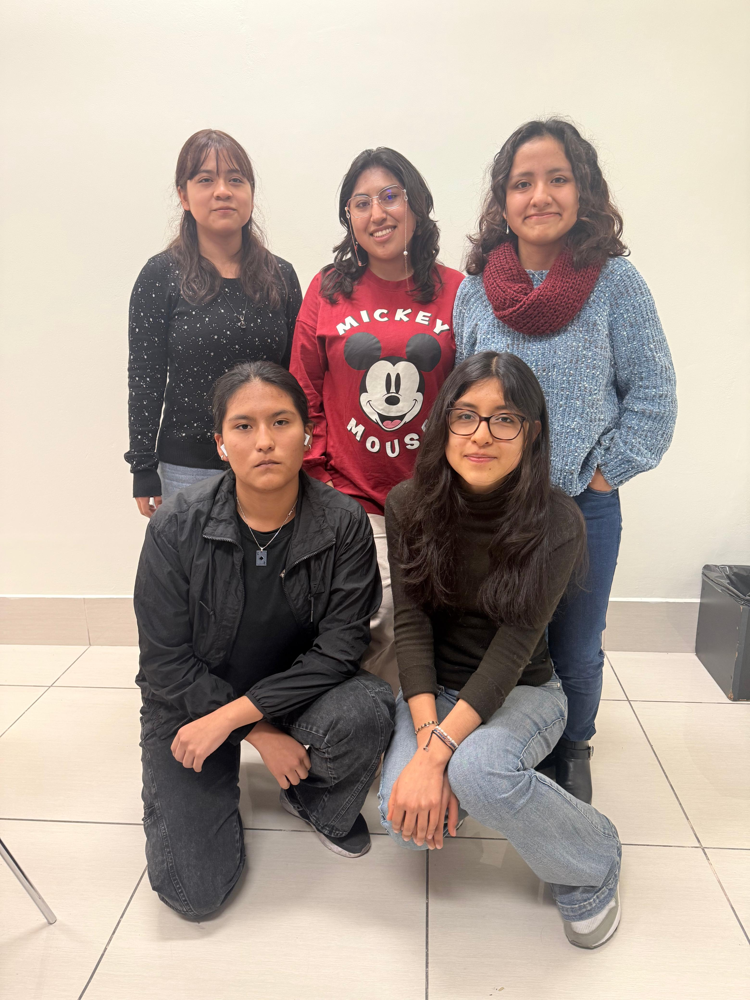
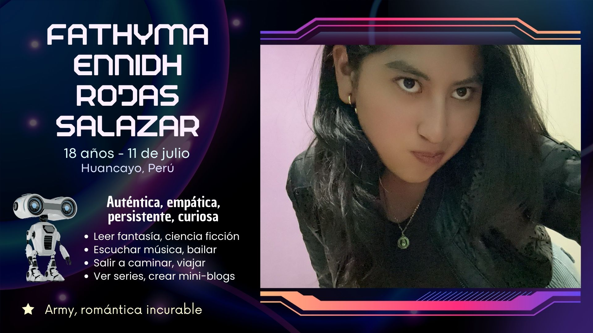
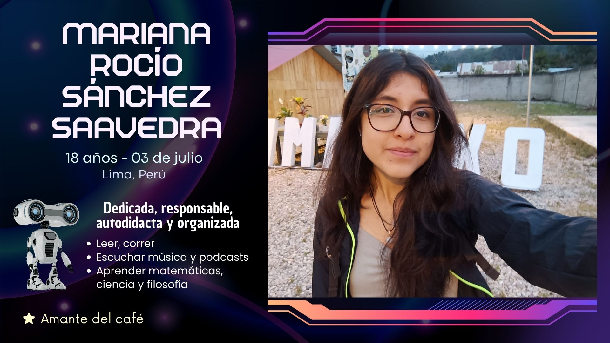
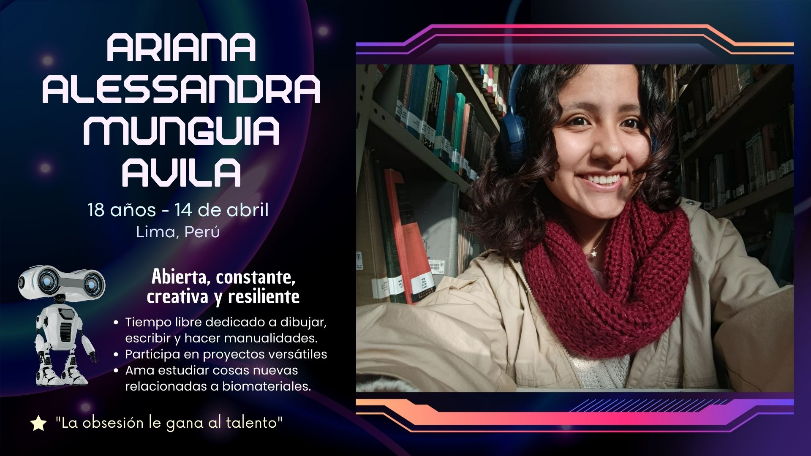
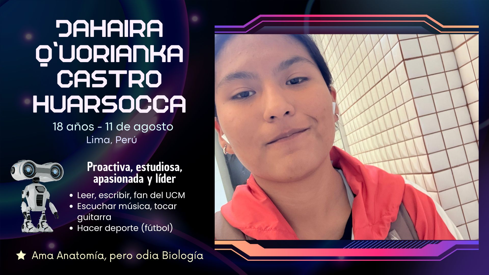
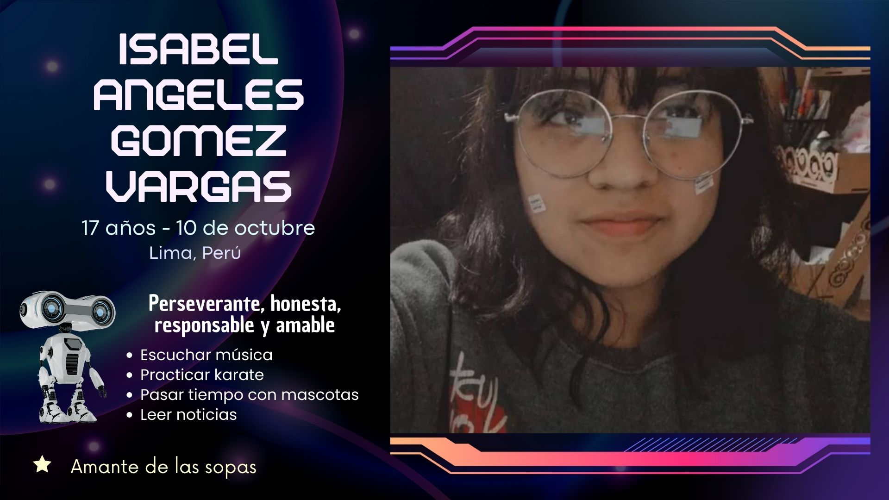

# 🦾⚙️ GRUPO 2 

# 🖊 DESCRIPCIÓN DEL GRUPO
Grupo conformado por 5 estudiantes de segundo ciclo de la carrera de Ingeniería Biomédica PUCP-UPCH. En este espacio vamos a compartir nuestros trabajos relacionados a los cursos de la carrera, por lo que será una recopilación de ideas, investigaciones, proyectos y documentos. Todo ello con el objetivo de desarrollar nuevas habilidades y poder crecer en conjunto. ¡¡Bienvenidos a nuestra creación!!

# 👥️ INTEGRANTES

# 📝 ¡CONÓCENOS!  
### 1. Fathyma Rojas

**Aportes en el grupo:** Actualizaciones constantes, motivación y conservación de ambiente positivo, resolución de tareas de último momento, diseños visuales, redacción

### 2. Mariana Sanchez

**Aportes en el grupo:** Redacción, tareas organizativas o analíticas, diseño de soluciones, resolución de problemas

### 3. Ariana Munguía

**Aportes en el grupo:** Búsqueda de repositorios, investigación y proactividad al realizar trabajos, comunicaciones

### 4. Jahaira Castro

**Aportes en el grupo:** Pensamiento crítico para analizar y resolver problemas, liderazgo y organización en proyectos, experiencia en investigación, diseño 3D y dibujo

### 5. Isabel Gomez

**Aportes en el grupo:** Investigación y búsqueda en bases de datos, organización

# ✨️ Gracias por visitar nuestro repositorio
