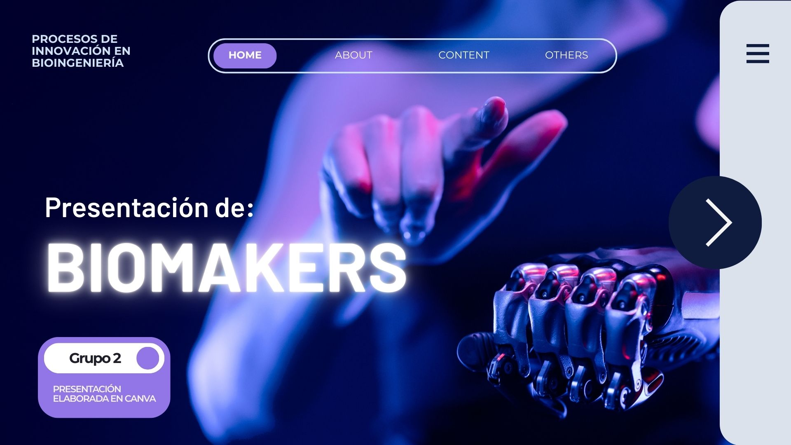

# GRUPO 2 - BIOMAKERS

# DESCRIPCIÓN DEL GRUPO
Grupo conformado por 5 estudiantes de segundo ciclo de la carrera de Ingeniería Biomédica PUCP-UPCH. En este espacio vamos a compartir nuestros trabajos relacionados a los cursos de la carrera, por lo que será una recopilación de ideas, investigaciones, proyectos y documentos. Todo ello con el objetivo de desarrollar nuevas habilidades y poder crecer en conjunto. ¡¡Bienvenidos a nuestra creación!!
# INTEGRANTES

# ACERCA DE LOS INTEGRANTES
